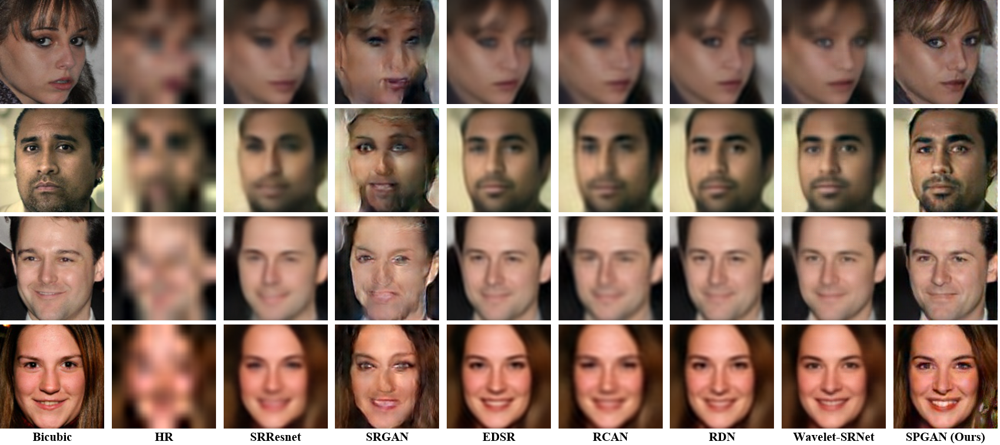

# SPGAN-PyTorch
[Project](https://github.com/Merle314/Supervised-Pixel-Wise-GAN) | [Arxiv](https://github.com/Merle314/Supervised-Pixel-Wise-GAN) | 
[PyTorch](https://github.com/Merle314/Supervised-Pixel-Wise-GAN)

<!-- -->

PyTorch implementation of Supervised Pixel-Wise GAN for Face Super Resolution.

## Prerequisites
* Python 3.5
* PyTorch 0.4

## Datasets
 * VGGFace2
 * CelebA
 * LFW
 * Helen

## Run

Use the default hyparameters except changing the parameter "upscale" according to the expected upscaling factor(2, 3, 4 for 4, 8, 16 upcaling factors, respectively).

>python main.py --ngpu=1 --test --start_epoch=0  --test_iter=1000  --batchSize=64 --test_batchSize=32 --nrow=4  --upscale=3 --input_height=128 --output_height=128 --crop_height=128 --lr=2e-4  --nEpochs=500 --cuda

## Result

Comparison with state-of-the-art methods through 8x super-resolution 16x16 input faces. Zooming-in details of important face parts confirm the effectiveness of our SPGAN.

---

Comparison with state-of-the-art methods through 16x super-resolution 8x8 input faces. Please zooming-in for details.

## Citation

If you use our codes, please cite the following paper:

## Acknowledgments
Code borrows heavily from [WaveeltSRNet](https://github.com/hhb072/WaveletSRNet).
